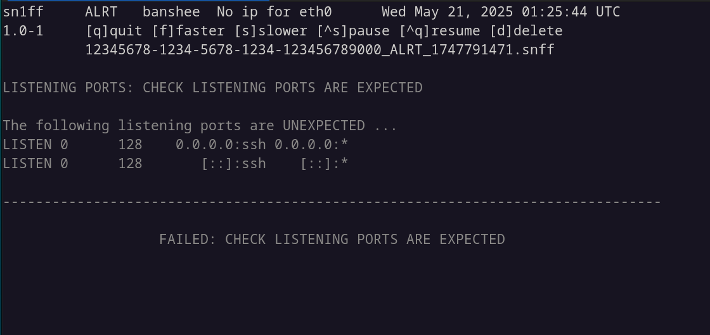
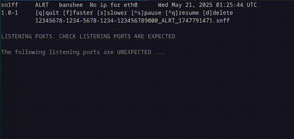

# sn1ff

*sn1ff* is a utility for running and monitoring system and security checks.

 It is a lightweight tool for creating, executing, and monitoring system and cybersecurity checks. Designed for Debian-based systems, it primarily supports Bash scripting to automate and log routine security tasks.


# Installation

*sn1ff* is available for current Debian based, Intel x64 distributions.

See file [INSTALL.md](./INSTALL.md)


# License

See file [LICENSE](./LICENSE)


# Screenshot

[

<p align="center">
  
</p>


# Overview

* **man sn1ff**

```
SN1FF(7)                                 Miscellaneous Information Manual                                SN1FF(7)

NAME
       sn1ff - enables users to write and monitor "checks"

DESCRIPTION
       sn1ff enables Linux system users, to write cybersecurity and system "checks" - using familiar scripting or
       program languages, and monitor the results of these checks - from a terminal or SSH login.

       There are 2 main parts to sn1ff:
       - sn1ff server
       - sn1ff client

   sn1ff server
       The sn1ff server runs the sn1ff_service systemd service. This collects files containing check results from
       remote  sn1ff_client  instances.  The  check results are delivered as files, to the sn1ff server using SCP
       with key authentication. The user (nologin) for the sn1ff_service, also acts for the SCP deliveries, using
       a "chroot jail"

       The  sn1ff server, also allows users who have membership of the sn1ff group, to run the sn1ff_monitor pro‐
       gram from a terminal or remote SSH login. The sn1ff_monitor allows user, to view the  received  check  re‐
       sults files in turn directly on the screen.

   sn1ff client
       The  sn1ff client, is intended primarily to be run, on other network hosts, sending the check results over
       the network to the sn1ff server. The check results are transported  using SCP with key authentication.

       However, you can also run the client locally on the sn1ff server, to perform checks on  the  sn1ff  server
       itself.

   Diagram
           .---------------------------------------------------------.
           |                        sn1ff server                     |
           |                                                         |
           |  User sn1ff:sn1ff                     User <you>:sn1ff  |        .---------------.
           |  .---------------.                   .---------------.  |        |     YOU       |
           |  | sn1ff_service | ---- domain ----  | sn1ff_monitor |<--------- |  terminal or  |
           |  '---------------'      socket       '---------------'  |        |  SSH login    |
           |      systemd     \                   /                  |        '---------------'
           |                   \                 /                   |
           |                    \               /                    |
           |                  .-------------------.                  |
           |          chroot  | upload directory  |                  |
           |          "jail"  '-------------------'                  |
           |                            ^                            |
           |                            |    .--------------.        |
           |                            |--- | sn1ff_client |        |
           |                            |    '--------------'        |
           |                            |                            |
           '----------------------------|----------------------------'
                                        |
                                        | SCP using key auth
                                        |
                                .--------------.
                                | sn1ff_client |
                                '--------------'|
                                 '--------------'|
                                  '--------------'

FURTHER INFORMATION
       For details of installation and example checks, see the sn1ff Github repository:

       https://github.com/GwynDavies/sn1ff

SEE ALSO
   Other related pages:
       sn1ff_service(8),  sn1ff_cleaner(8),  sn1ff_monitor(1),  sn1ff_client(1), 
       sn1ff_license(1), sn1ff_conf(1), chroot(8), systemd(1).

AUTHOR
       Written by Gwyn Davies

       https://github.com/GwynDavies/sn1ff
```
                                                                                                         SN1FF(7)
